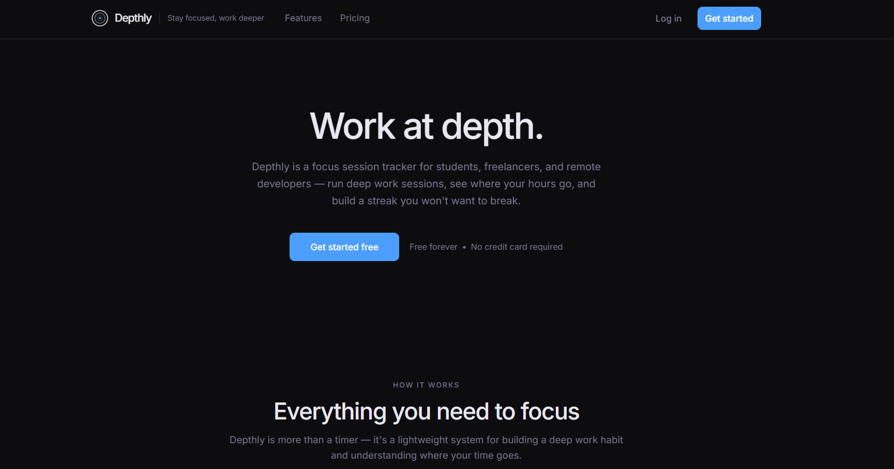
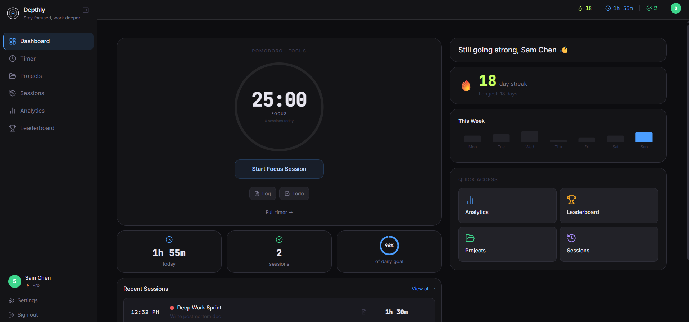
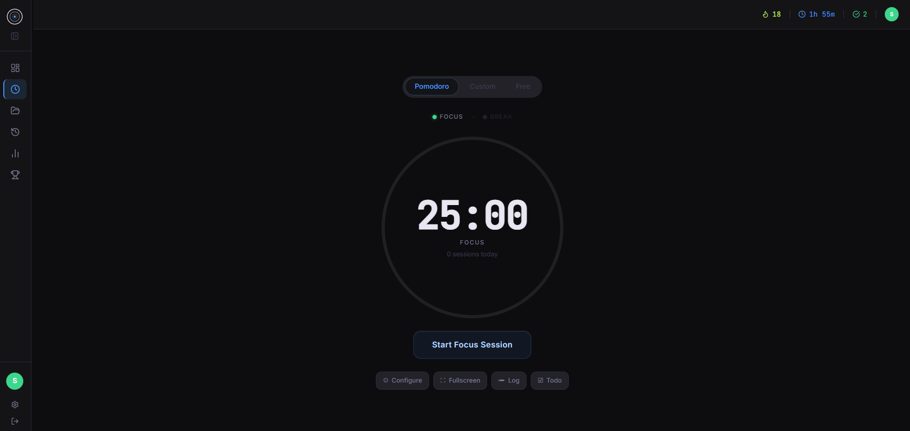
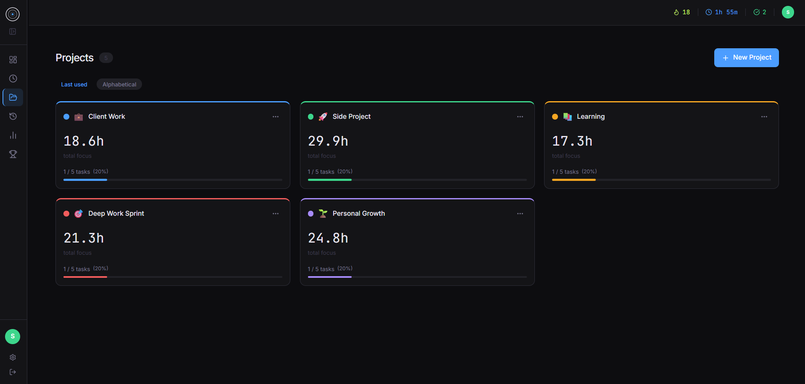
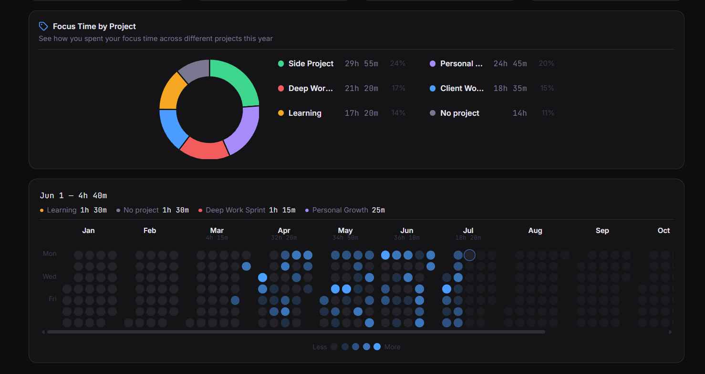

# Depthly

**Work at depth.** A focus session tracker and time-tracking SaaS for students, freelancers, and remote developers building deep work habits.

Depthly pairs a Pomodoro/stopwatch timer with project- and task-level time tracking, then turns every session into daily/weekly/monthly/yearly analytics, streaks, and a social leaderboard.

---

## Screenshots

| Landing | Dashboard |
|---|---|
|  |  |

| Timer | Projects |
|---|---|
|  |  |

| Analytics (yearly heatmap) |
|---|
|  |

More views in [`/screenshots`](screenshots).

---

## Features

- **Focus timer** — Pomodoro, custom interval, or free stopwatch modes; configurable work/break lengths and daily goal; fullscreen mode; optional task linking.
- **Projects** — group sessions and tasks under color-coded projects; per-project totals and progress.
- **Tasks** — list view (drag-to-reorder) and Kanban board (drag within/across columns), priorities, due dates, per-task session time.
- **Analytics** — Daily / Weekly / Monthly / Yearly views: focus time, session counts, streaks, focus-time-by-project donut, daily timeline, and a GitHub-style yearly heatmap calendar.
- **Streaks & goals** — daily/weekly goal minutes, current streak, longest streak.
- **Leaderboard** — global and friends-only rankings by focus time or streak, weekly/monthly/all-time windows; opt-in public profiles at `/u/:slug`.
- **Sessions log** — searchable/filterable history with CSV export (Pro).
- **Billing** — Free / Pro / Lifetime (Founding Member) plans with enforced free-tier limits.
- **PWA** — installable, offline-friendly shell.
- **Auth** — email/password and Google OAuth via Supabase Auth.
- **Public marketing landing page** at `/`, with GSAP scroll animations, separate from the authenticated app (which lives at `/dashboard`).

---

## Tech stack

| Layer | Choice |
|---|---|
| Frontend | React 18 + Vite + TypeScript (strict) |
| Styling | Tailwind CSS, custom dark-first design tokens |
| Client state | Zustand (`authStore`, `timerStore`, `uiStore`) |
| Server state | TanStack Query (no data fetching in `useEffect`) |
| Backend | Supabase (Postgres, Auth, RLS, Edge Functions, Storage) — no separate server |
| Multi-table writes | Supabase RPC functions (`SECURITY DEFINER`), never direct client writes |
| Payments | Lemon Squeezy (merchant-of-record) via Supabase Edge Functions — see [`docs/BILLING_STATUS.md`](docs/BILLING_STATUS.md) for why this replaced Stripe |
| Charts | Recharts |
| Drag & drop | dnd-kit |
| UI primitives | Radix UI + class-variance-authority |
| Animation | GSAP (landing page only) |
| Deploy | Vercel |

---

## Project structure

```
src/
  components/
    ui/            Reusable primitives: Button, Card, Badge, Spinner, Logo...
    layout/         AppLayout, AuthLayout, Sidebar, Topbar
    dashboard/, timer/, projects/, tasks/, analytics/,
    leaderboard/, billing/, goals/, sessions/, settings/,
    landing/        Feature-scoped components
    LogoIntro/       Splash/intro animation
  pages/            Route-level components (Dashboard, Timer, Projects, Analytics...)
  pages/auth/       Login, Signup, ForgotPassword, ResetPassword
  hooks/            useAuth, useTimer, usePlan, useProjects, useSessions...
  hooks/shared/     Cross-feature hooks
  store/            authStore.ts, timerStore.ts, uiStore.ts (Zustand)
  lib/
    supabase/       client.ts (typed Supabase client), queries/ (typed query functions)
    utils/          Shared helpers
  types/            database.ts (generated from Supabase), app.ts (custom types)
  routes/           router.tsx (route table), ProtectedRoute.tsx
  styles/           globals.css (design tokens)

supabase/
  migrations/       SQL schema + RPC functions
  functions/        Edge Functions: create-checkout, lemonsqueezy-webhook

docs/               Feature-level implementation references (see below)
```

Path alias: always import from `src/` via `@/` (e.g. `@/components/Button`), never relative `../../` paths.

---

## Getting started

### Prerequisites

- Node.js 18+
- A [Supabase](https://supabase.com) project
- (Optional, for billing) A [Lemon Squeezy](https://www.lemonsqueezy.com) store

### Install

```bash
npm install
```

### Configure environment

Copy the example env file and fill in your own values:

```bash
cp .env.example .env.local
```

| Variable | Where it's used | Notes |
|---|---|---|
| `VITE_SUPABASE_URL` | Client | From Supabase → Settings → API |
| `VITE_SUPABASE_ANON_KEY` | Client | Do not rename this key |
| `VITE_APP_NAME` | Client | Display name |
| `VITE_APP_URL` | Client + Edge Function secret | Used to build checkout redirect URLs |
| `VITE_STRIPE_PUBLISHABLE_KEY` | Client | Legacy/optional, not the active payment processor |
| `LEMONSQUEEZY_STORE_ID` | Edge Function secret only | No `VITE_` prefix — never bundled client-side |
| `LEMONSQUEEZY_VARIANT_PRO_MONTHLY` | Edge Function secret only | |
| `LEMONSQUEEZY_VARIANT_PRO_YEARLY` | Edge Function secret only | |
| `LEMONSQUEEZY_VARIANT_LIFETIME` | Edge Function secret only | |
| `LEMONSQUEEZY_API_KEY` | Edge Function secret only | |
| `LEMONSQUEEZY_WEBHOOK_SECRET` | Edge Function secret only | Verifies `lemonsqueezy-webhook`'s `X-Signature` header |
| `SUPABASE_SERVICE_ROLE_KEY` | Local scripts only | For `seed-demo-users.ts`; put in `.env.local`, never commit |

Set the `LEMONSQUEEZY_*` and `VITE_APP_URL` secrets on Supabase (not in the client env) with:

```bash
supabase secrets set LEMONSQUEEZY_API_KEY=... LEMONSQUEEZY_WEBHOOK_SECRET=...
```

### Set up the database

Run the migrations in `supabase/migrations/` against your Supabase project (SQL editor or `supabase db push`), in order:

1. `001_initial_schema.sql` — tables, enums, RLS policies
2. `002_save_session_rpc.sql` — the `save_session()` RPC (`SECURITY DEFINER`) that every session save must go through
3. `003_avatars_storage_policies.sql` — storage policies for avatar uploads

Deploy the Edge Functions:

```bash
supabase functions deploy create-checkout
supabase functions deploy lemonsqueezy-webhook --no-verify-jwt
```

### Run the dev server

```bash
npm run dev
```

### Other scripts

```bash
npm run build      # tsc -b && vite build
npm run preview     # preview the production build
npm run lint         # eslint, zero warnings allowed
npm run format       # prettier --write
npm run typecheck    # tsc --noEmit
```

---

## Database rules

- Every session save goes through the `save_session()` RPC — never write directly to `daily_summaries` or `user_stats` from the client.
- `profiles.plan` is the fast-read billing state — check this, not the `subscriptions` table, for gating features.
- Tasks have two independent ordering columns: `list_order` (list view) and `kanban_order` (Kanban view) — never share one for both.
- `goals` stores minutes as integers.
- `period_key` formats: daily `2025-01-15`, weekly `2025-W03`, monthly `2025-01`, yearly `2025`.

---

## Free plan limits

Enforced at the API layer via `usePlan().checkLimit(type)`, never inlined:

| Limit | Free | Pro / Lifetime |
|---|---|---|
| Projects | 3 | Unlimited |
| Sessions / month | 50 | Unlimited |
| Analytics window | 7 days (older data blurred) | Full history |
| CSV export | Blocked | Enabled |
| Leaderboard appearance | Blocked | Enabled |

---

## Design system

Dark mode first (light mode is not implemented). Key tokens (`tailwind.config.ts` / `src/styles/globals.css`):

| Token | Value | Use |
|---|---|---|
| `depth-bg` | `#0D0D10` | App background |
| `depth-surface` | `#141417` | Cards, panels, modals |
| `depth-raised` | `#222228` | Hover states, nested panels |
| `depth-border` | `#2E2E38` | Dividers, input borders |
| `brand` | `#4B9EFF` | CTAs, active states, links |
| `brand-strong` | `#2563EB` | Hover state |
| `streak` | `#C8FF64` | Streak display only — never decorative |
| `ink-primary` | `#E8E6F0` | Headlines, body text |
| `ink-secondary` | `#7A7890` | Captions, timestamps |
| `ink-muted` | `#3D3B4E` | Placeholders, disabled state |

Typography: Inter (UI text, weight 500), JetBrains Mono via the `font-data` class for all numbers/times/durations/stats. See [`docs/STYLE_SYSTEM.md`](docs/STYLE_SYSTEM.md) for the full reference, including known inconsistencies.

---

## Documentation

Detailed, code-accurate implementation references live in [`docs/`](docs) — read the relevant one before touching a feature:

| Doc | Covers |
|---|---|
| [DASHBOARD.md](docs/DASHBOARD.md) | Dashboard layout and data composition |
| [timer.md](docs/timer.md) | Timer architecture, state, RPC |
| [PROJECTS.md](docs/PROJECTS.md) | Project data model and UI |
| [TASKS.md](docs/TASKS.md) | Task list/Kanban, ordering columns |
| [ANALYTICS.md](docs/ANALYTICS.md) | Daily/Weekly/Monthly/Yearly views, data sources |
| [LEADERBOARD.md](docs/LEADERBOARD.md) | Ranking logic, public profiles, follows |
| [GOALS_AND_SESSIONS.md](docs/GOALS_AND_SESSIONS.md) | Goals data model, sessions log |
| [SETTINGS.md](docs/SETTINGS.md) | Settings page sections |
| [BILLING_STATUS.md](docs/BILLING_STATUS.md) | Lemon Squeezy integration status and history |
| [EXPORT_AND_PWA.md](docs/EXPORT_AND_PWA.md) | CSV export, PWA setup |
| [LANDING.md](docs/LANDING.md) | Public marketing landing page |
| [STYLE_SYSTEM.md](docs/STYLE_SYSTEM.md) | Design tokens as they actually exist in code |

These docs are the source of truth for implementation details, component props, hook behavior, and known limitations — prefer them over inference from this README.

---

## What not to do

- No Express, Prisma, next-auth, or any other backend framework — Supabase only.
- No data fetching in `useEffect` — use TanStack Query.
- No direct client writes to `daily_summaries` or `user_stats`.
- No use of the streak color (`#C8FF64`) outside `StreakBadge.tsx`.
- No relative `../../` imports — always `@/`.
- No `any` types — add a real type to `src/types/app.ts`.
- No inline free-plan-limit logic — always route through `usePlan()`.

---

## Status

Actively developed, pre-launch. See [`ROADMAP.md`](ROADMAP.md) for the release plan (V1 → V1.5 → V2 → V3) and [`docs/BILLING_STATUS.md`](docs/BILLING_STATUS.md) for the current Lemon Squeezy integration state.

---

## License

Private project — all rights reserved.
